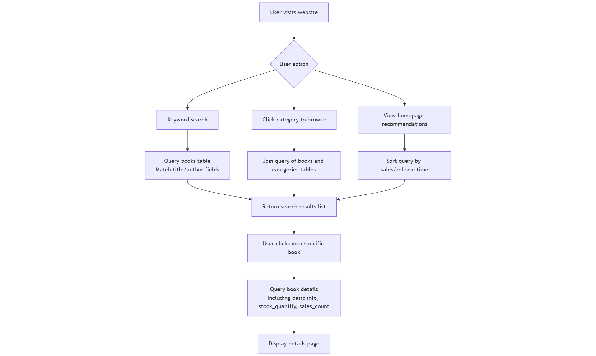
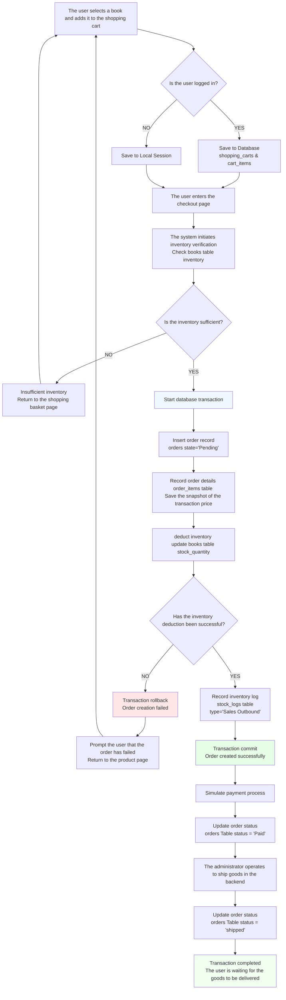
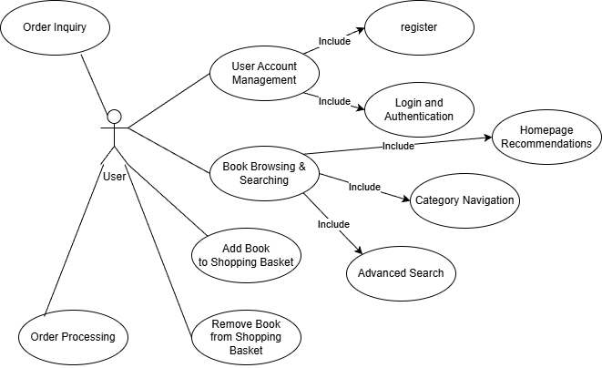
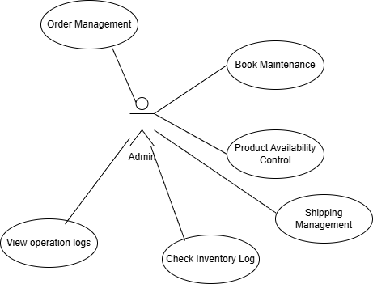

# Database Scenario And Requirements Analysis

### 1.Database Scenario

#### 1.1 Business background and overview

In the context of the continuous development of e-commerce, traditional physical bookstores are facing the practical need to transition online. This course design project plans to build a complete "online bookstore system" using a browser/server (B/S) architecture, aiming to simulate and implement a real online book sales business process. This system is not only a window for displaying book information but also a comprehensive e-commerce platform that integrates user interaction, order transactions, inventory management, and back-end operations. By constructing such a system, we hope to theoretically break the constraints of traditional bookstores in terms of business hours and geographical space, enabling round-the-clock, cross-regional book retail services.

The system is divided into two major modules: the front-end user interface and the back-end management interface, both of which share the same underlying PostgreSQL relational database. This design ensures real-time synchronization and strong consistency of data between the front and back ends, providing reliable data support for core business processes.

#### 1.2 Target users and role personas

From the perspective of database design, the users of the system are mainly divided into two key roles, which directly affects the structural design of data tables and the permission control strategy.

End consumers are the primary source of system traffic. They may browse the website as visitors, view homepage recommendations, filter by book categories, or use the search function to find specific books. After registering and logging in, users have personal accounts that allow them to manage persistent shopping carts and view historical orders. Such user scenarios are often accompanied by high-frequency data retrieval operations, such as book searches and detail browsing, requiring the system to respond quickly to such queries. At the same time, during the ordering process, there are strict requirements for the consistency of inventory data, and over-selling must be avoided.

The system administrator is responsible for the operation and maintenance of the platform, possessing the highest authority in system management. They are tasked with configuring basic system parameters, managing user accounts, and setting system access permissions. Additionally, they handle daily system tasks such as adding and removing books from the shelves, adjusting prices, and more. Furthermore, they should be able to view user order details and handle special situations like refunds.

#### 1.3 Core business process scenarios

##### 1.3.1 Book retrieval and display scenario

Book retrieval and display are the primary steps for users to interact with the system, and the database needs to efficiently support multiple query modes.

When a user enters a keyword for a fuzzy search, the system needs to perform a match in the title and author fields of the books table. For example, if the user enters "The Three-Body Problem" or "Liu Cixin", the system must perform a fuzzy match in the `title`​ and `author`​ fields of the `books` table.

Users can also search by precise ISBN numbers or filter books by clicking on preset category tags (such as "Literature" or "Science and Technology"), triggering an associated query between the `books`​ and `categories` tables. This involves an associated query between the books table and the categories table.

On the book detail page, the system must not only display static information such as price and publisher, but also query the `stock_quantity`​ table in real time to show the inventory quantity and indicate whether the book is available. Additionally, it should reflect the popularity of the book based on the data from the `sales_count` table.

##### 1.3.2 Shopping cart and transaction scenario

Shopping cart and order transactions constitute the core business of the system, directly testing the stability and rigor of database design. After users add their desired books to the shopping cart, if they are logged in, these purchase records will be saved to the `shopping_carts`​ and `cart_items` tables to achieve data persistence.

Upon entering the checkout page, the system will perform another inventory verification on all items in the shopping cart to ensure they are available for purchase. Then, through transaction processing, the system will first insert a "pending payment" order into the main orders table, and subsequently record the purchased books and their transaction prices in the order details, in order to prepare for potential future price changes.

Subsequently, the inventory in the 'books' table is synchronously deducted. If the inventory is insufficient at this time, the entire operation will be rolled back, and the order creation will fail. Once the deduction is successful, the system will automatically record a "sales outbound" in the inventory log to ensure that every inventory change is traceable. After the order is generated, as the simulated payment is completed and the backend shipping operation is performed, its status will be sequentially changed to "paid" and "shipped", indicating the completion of the transaction.

##### 1.3.3 Background fine management scenario

Back-end management focuses on operational refinement and security.

When managing inventory, any modifications to inventory quantity by the administrator (whether it is purchase receipt or inventory adjustment) cannot be updated directly and seamlessly. Instead, it must be done by triggering inventory log records, which should include the operator, the quantity before and after the change, and the reason for the change.

Similarly, for sensitive operations such as deleting users or modifying order amounts, the system must also maintain a comprehensive record in the operation log table, including the operator, IP address, execution time, and specific parameters, thereby establishing a reliable security audit and tracking capability.

---

### 2.Requirements Analysis

#### 2.1 Functional Requirements

##### 2.1.1 Front-end user subsystem

1. **User Account Management**

    - **Registration**: Users are required to provide information such as username, password, email, and full name. The system must verify the uniqueness of the username (Uniqueness Constraint) and the complexity of the password. The password must be hashed (e.g., using bcrypt) before being stored in the database.
    - **Login and Authentication**: Supports username/email + password login. Upon successful login, a Token or Session Cookie will be issued.
2. **Book Browsing & Searching**

    - **Homepage recommendation**: Display the books with the highest sales or newly listed books.

    - **Category Navigation**: Provides tree-like or list-like navigation.
    - **Advanced Search**: Supports combined queries by title, author, and ISBN, and the search is case-insensitive.
3. **Shopping Chart**

    - **State management**: Users can add books to their shopping cart, modify the quantity of items purchased, or remove items at any time.
    - **Dynamic calculation**: Calculate the total amount of goods in the shopping cart in real-time.
    - **Inventory Pre-judgment**: When adjusting the quantity, if it exceeds the current inventory, the system should provide a prompt.
4. **Order Processing**

    - **Checkout process**: Confirm delivery information -> Select payment method -> Confirm order summary.
    - **Inventory deduction**: Upon successful order placement, the system automatically deducts the inventory of the corresponding book and increments the sales of that book.
    - **Order Inquiry**: Users can view their historical order list and current status (pending payment, shipped, etc.).

The requirements mentioned above can be represented by the use case diagram below.

##### 2.1.2 Back-end management subsystem

1. **Dashboard**

    Provide a data visualization overview, including: total number of users, total number of orders, total sales amount, and a list of inventory-warning products.
2. **Product & Inventory Management**

    - **Book maintenance**: Supports adding, deleting, modifying, and querying books. Includes uploading cover images, setting categories, pricing, etc.
    - **On-shelf and off-shelf control**: Quickly control the front-end visibility of books through status fields.
    - **Inventory Log**: All inventory changes (purchase receipts, sales deliveries, inventory adjustments) must be recorded through a log table. Untraceable modifications to inventory are strictly prohibited.
3. **Order lifecycle management**

    - **Order management**: Administrators can intervene in the order process and manually modify the status (such as confirming shipment, processing refunds, and canceling malicious orders).
    - **Shipping management**: Enter logistics information.
4. **System Monitoring and Logging**

    - **Operation audit**: View the operation logs to trace which administrator modified which piece of data at what time, ensuring accountability.

The requirements mentioned above can be represented by the use case diagram below.

#### 2.2 Non-functional Requirements

1. **Security**

    - **Data encryption**: User passwords cannot be stored in plaintext.
    - **Access control**: The backend management interface must undergo Token verification and permission check.
    - **Prevent injection**: The database interaction layer (such as Prisma or native SQL) must use parameterized queries to prevent SQL injection attacks.
2. **Performance**

    - **Index optimization**: According to the SQL script, an index needs to be established on high-frequency query fields.
    - **Concurrent processing**: In high-concurrency scenarios involving inventory deduction, it is necessary to utilize database transactions and row-level locking mechanisms to prevent overselling.
3. **Usability**

    - The front-end page should respond quickly, with search results returned in milliseconds.
    - Shopping cart data should be maintained across sessions when the user is logged in, to enhance user experience.
4. **Scalability**

    - The database design should reserve expansion space.
    - The payment method table is designed independently, supporting the integration of more payment channels in the future.

#### 2.3 Interface Requirements

1. **Web interface**

    - It must include a unified top navigation bar (Home, Search, Login/Logout).
    - **Homepage**: Large banner images showcase events, with book covers displayed in a grid layout below.
    - **Search page**: Multiple condition filters are provided on the left or top, and search results are displayed in a list format, including cover, title, price, and author.
    - **Checkout page**: A clear step bar guides users through the process of confirming the order, filling in the address, and completing the payment.
2. **System feedback**

    - **Form validation**: On the registration and login pages, the front end needs to provide immediate feedback on format errors (such as incorrect email format).
    - **Operational Feedback**: A Toast notification should be displayed upon successful addition to the shopping cart; a modal box warning should be displayed when inventory is insufficient.

---

‍
