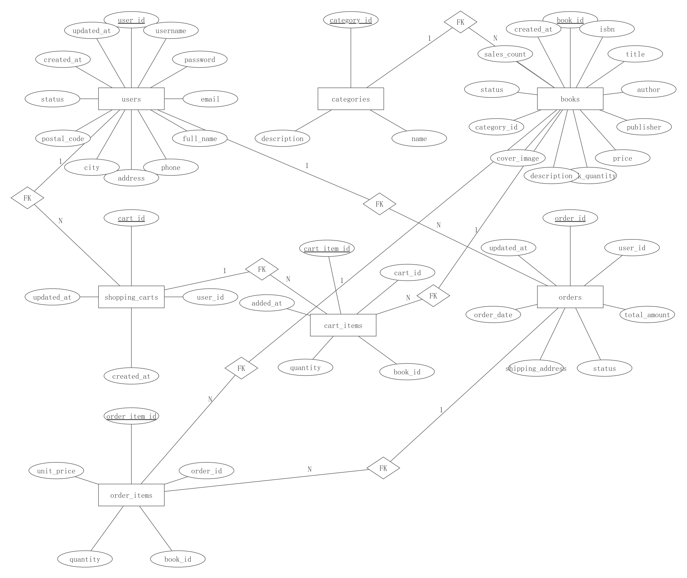
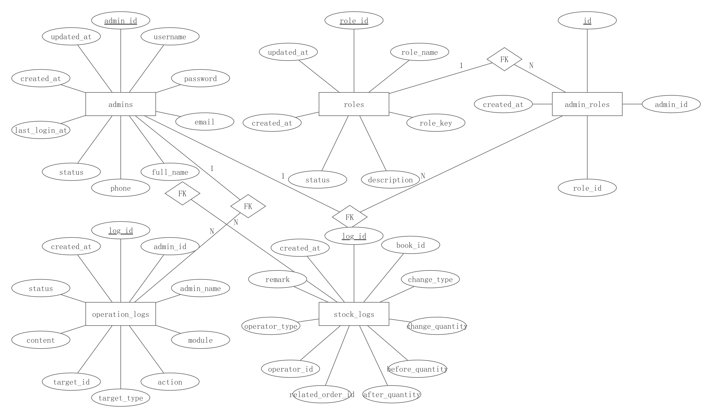

# ***\*ER Diagram Design\****

This system is an online bookstore management system, which is functionally divided into two major parts: the **user-side business system** and the **administration-side management system**.
Based on the requirement analysis, two separate Entity-Relationship (ER) diagrams are designed to describe the core entities and their relationships in the system, providing a clear foundation for subsequent database logical and physical design.

## ***\*1. User-Side ER Diagram Design\****

The user-side ER diagram focuses on the core business operations of ordinary users, including **user management, book browsing, shopping cart management, and order processing**. The main entities and their relationships are described as follows.

### ***\*1.1 Entity Design\****

#### ***\*(1) USER\****

The USER entity represents registered users of the system and stores basic user information, including:

Unique user identifier (user_id)

Authentication information (username, password, email)

Contact information (full_name, phone, address, city, postal_code)

User status (status)

Creation and update timestamps (created_at, updated_at)

The USER entity is one of the core entities in the system.

#### ***\*(2) CATEGORY\****

The CATEGORY entity is used to manage book classifications. It includes:

Category identifier (category_id)

Category name and description (name, description)

#### ***\*(3) BOOK\****

The BOOK entity represents books sold in the system. It includes:

Basic book information (isbn, title, author, publisher)

Price and inventory information (price, stock_quantity)

Book description and cover image (description, cover_image)

Book status and sales count (status, sales_count)

Associated category (category_id)

#### ***\*(4) SHOPPING_CART\****

The SHOPPING_CART entity represents a user’s shopping cart and includes:

Shopping cart identifier (cart_id)

Associated user (user_id)

Creation and update timestamps (created_at, updated_at)

#### ***\*(5) CART_ITEM\****

The CART_ITEM entity represents individual items within a shopping cart, including:

Cart item identifier (cart_item_id)

Associated shopping cart (cart_id)

Referenced book (book_id)

Quantity of the book (quantity)

Time when the item was added (added_at)

#### ***\*(6) ORDER\****

The ORDER entity represents an order placed by a user. It includes:

Order identifier (order_id)

Associated user (user_id)

Total order amount and status (total_amount, status)

Shipping address (shipping_address)

Order creation and update times (order_date, updated_at)

#### ***\*(7) ORDER_ITEM\****

The ORDER_ITEM entity represents individual items within an order, including:

Order item identifier (order_item_id)

Associated order (order_id)

Referenced book (book_id)

Quantity and unit price at the time of purchase (quantity, unit_price)

### ***\*1.2 Relationship Design\****

The main relationships in the user-side ER diagram are as follows:

**USER and SHOPPING_CART**: One-to-one relationship
Each user can have at most one shopping cart.

**SHOPPING_CART and CART_ITEM**: One-to-many relationship
A shopping cart can contain multiple cart items.

**USER and ORDER**: One-to-many relationship
A user can place multiple orders.

**ORDER and ORDER_ITEM**: One-to-many relationship
An order can include multiple order items.

**BOOK and CART_ITEM / ORDER_ITEM**: One-to-many relationships
A single book may appear in multiple cart items or order items.

**CATEGORY and BOOK**: One-to-many relationship
A category can contain multiple books.

This design accurately models the user-side business workflow and follows common e-commerce system modeling practices.

## ***\*2. Administration-Side ER Diagram Design\****

The administration-side ER diagram focuses on **system management functions**, including **role-based access control, operation logging, and inventory management**, ensuring system security, maintainability, and traceability.

### ***\*2.1 Entity Design\****

#### ***\*(1) ADMIN\****

The ADMIN entity represents system administrators and includes:

Administrator identifier (admin_id)

Authentication and contact information (username, password, email, full_name, phone)

Administrator status (status)

Last login time (last_login_at)

Creation and update timestamps (created_at, updated_at)

#### ***\*(2) ROLE\****

The ROLE entity defines administrator roles for permission management and includes:

Role identifier (role_id)

Role name and unique key (role_name, role_key)

Role description and status (description, status)

Creation and update timestamps (created_at, updated_at)

#### ***\*(3) ADMIN_ROLE\****

The ADMIN_ROLE entity is an associative entity used to implement the many-to-many relationship between administrators and roles. It includes:

Association identifier (id)

Administrator identifier (admin_id)

Role identifier (role_id)

Creation time (created_at)

#### ***\*(4) OPERATION_LOG\****

The OPERATION_LOG entity records administrative operations performed in the system for auditing and tracking purposes. It includes:

Log identifier (log_id)

Administrator information (admin_id, admin_name)

Operation module and action (module, action)

Target object type and identifier (target_type, target_id)

Operation content and status (content, status)

Operation timestamp (created_at)

#### ***\*(5) STOCK_LOG\****

The STOCK_LOG entity records inventory changes of books to support inventory auditing and historical tracking. It includes:

Log identifier (log_id)

Associated book (book_id)

Change type and quantity (change_type, change_quantity)

Inventory quantity before and after the change (before_quantity, after_quantity)

Related order and operator information (related_order_id, operator_id, operator_type)

Remarks and creation time (remark, created_at)

### ***\*2.2 Relationship Design\****

The main relationships in the administration-side ER diagram are as follows:

**ADMIN and ROLE**: Many-to-many relationship
An administrator can have multiple roles, and a role can be assigned to multiple administrators. This relationship is implemented through the ADMIN_ROLE associative entity.

**ADMIN and OPERATION_LOG**: One-to-many relationship
An administrator can generate multiple operation logs.

**BOOK and STOCK_LOG**: One-to-many relationship
A book may undergo multiple inventory changes during its lifecycle, resulting in multiple stock log records.

## ***\*3. Summary\****

By separating the ER diagram design into user-side and administration-side components, system complexity is reduced and business logic becomes clearer. The user-side ER diagram focuses on transaction and user behavior modeling, while the administration-side ER diagram emphasizes access control, logging, and inventory management. Together, these designs provide a solid foundation for subsequent database implementation and system development.

 

# ***\*Technical Framework\****

This system adopts a **modern full-stack Web architecture** design pattern. The overall technical framework is divided into four core layers: the **presentation layer (Frontend)**, **business logic layer (Backend)**, **data persistence layer (Database)**, and **supporting toolchain**.
This layered architecture features clear separation of responsibilities, strong scalability, and high maintainability.

## ***\*1. Technology Stack Overview\****

| ***\*Layer\**** | ***\*Main Technologies\****         | ***\*Description\****                               |
| --------------- | ----------------------------------- | --------------------------------------------------- |
| Frontend        | Vue.js, Vike, Tailwind CSS, DaisyUI | Implements responsive UI and user interaction       |
| Backend         | Node.js, Express, TypeScript        | Provides RESTful API services                       |
| ORM             | Prisma                              | Type-safe database access and data model management |
| Build Tools     | Vite, pnpm                          | Frontend build and dependency management            |
| Deployment      | Vercel                              | Deployment for frontend and SSR services            |

##  

## ***\*2. Overall Architecture\****

The system adopts a **Frontend–Backend Separation + RESTful API + SSR (Server-Side Rendering) Support** architecture, as illustrated below:

Browser Client

   ↓ HTTP/HTTPS RESTful API

Frontend Application (Vue + Vike)

   ↓ Business Requests

Backend Service (Express)

   ↓ ORM Queries

Database (PostgreSQL)

This architecture decouples the frontend from the backend through unified API interfaces. Data is exchanged via RESTful APIs, separating presentation logic from business processing logic, which improves flexibility and maintainability.

## ***\*3. Presentation Layer (Frontend)\****

The frontend is developed using **Vue.js** as the primary framework, combined with **Vike** to support file-based routing and server-side rendering (SSR).

Vike supports **hybrid rendering modes**, allowing pages to be rendered either on the server or on the client as needed, which helps improve initial page load performance.

Main frontend technologies include:

**Vue.js**: Used to build component-based user interfaces.

**Tailwind CSS + DaisyUI**: Used for rapid UI styling and consistent visual design.

**Vike**: Handles routing, page rendering, and SSR support.

**Vite + pnpm**: Serve as the build tool and package manager, improving development efficiency and build speed.

**Axios / Fetch**: Used by the frontend to call backend RESTful APIs and retrieve JSON-formatted data via HTTP requests.

This layer is responsible for user interface rendering and interaction logic, including book listing, searching, shopping cart management, user profile pages, and order processing workflows.

## ***\*4. Business Logic Layer (Backend)\****

The backend is built using **Node.js, Express, and TypeScript**, and is responsible for core business logic and API services.

Key backend technologies include:

**Express**: A lightweight web framework used to define routes, middleware, and security mechanisms.

**TypeScript**: Provides static type checking to improve code quality and maintainability.

**RESTful API Design**: Backend APIs are organized around resources and provide unified data services to the frontend.

**Server Middleware**: Handles cross-origin requests (CORS), authentication, authorization, and logging.

Core backend business modules include:

User authentication and authorization module;

Book and product management module;

Shopping cart and order processing module;

Inventory update and business rule control module.

Each business function is clearly separated using Express routing, resulting in a modular and maintainable backend architecture.

### ***\*5. Data Persistence Layer (Database & ORM)\****

The system adopts **PostgreSQL** as the relational database management system for persistent data storage.
Database access, schema definition, and migration management are implemented using **Prisma ORM**, which provides **type-safe queries**, automated schema synchronization, and improved development reliability.

Key components include:

**Prisma ORM**: Used to define database models, automatically generate type-safe data access code, and manage database migrations, thereby reducing manual SQL usage and improving development efficiency.

**Database Engine**: PostgreSQL is used as the primary relational database engine in this system.

**Schema Management**: The database schema is defined and maintained through Prisma schema files, ensuring consistency between application models and database structures.

The database design follows standard **Entity-Relationship (ER) modeling principles**, and Prisma ORM models are mapped directly to relational tables. This design enables reliable and persistent storage of core entities such as users, books, categories, orders, and administrative data.

## ***\*6. Frontend–Backend Interaction and API Specification\****

The system adopts a unified **RESTful API specification** for frontend–backend communication. The frontend sends HTTP requests (typically using Fetch or Axios) and exchanges data in JSON format, while the backend returns structured response objects.

Typical API designs include:

| ***\*Function\**** | ***\*Method\****     | ***\*Description\****                               |
| ------------------ | -------------------- | --------------------------------------------------- |
| Get book list      | GET /books           | Retrieve paginated book data by category or keyword |
| User registration  | POST /users/register | Register a new user                                 |
| User login         | POST /users/login    | Authenticate user and return token                  |
| Place order        | POST /orders         | Submit a new order                                  |

The RESTful design ensures that APIs are easy to understand, test, and maintain.

## ***\*7. Security and Performance Support\****

The system incorporates multiple security and performance considerations, including:

**User Authentication Mechanism**: Supports login, logout, and token validation;

**Access Control**: Differentiates between regular users and administrators;

**Input Validation**: Validates request parameters to ensure data correctness;

**Static Asset Optimization**: Uses Vite to build and optimize static resources;

**SSR Performance Optimization**: Improves initial page load performance and SEO friendliness.

## ***\*8.Summary\****

This technical framework is well-suited for medium-scale Web application development and provides a solid foundation for future system expansion.

 